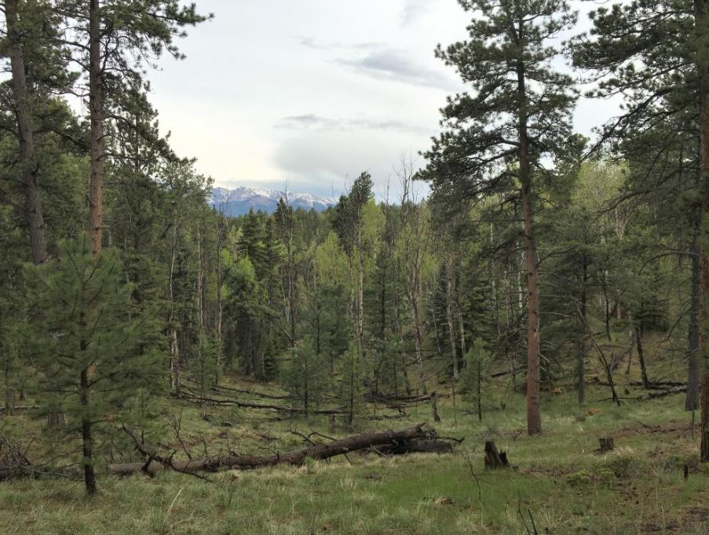

# Name

Jeffery Cannon

## Biography

I am a podiatrist focusing on research in hurricane ecology, longleaf pine restoration, prescribed fire, and fostering the adoption of technology for conservation using lidar. I especially enjoy blending research and collaboration with land managers to solve practical conservation challenges.

Outside of work, I enjoy staying active outdoors with backpacking, hiking, tennis, and pickleball. I am an avid reader of nonfiction, always looking to learn from science, math, business, and history, and am engaged in politics and civic engagement in my adopted hometown of Albany, GA.

{height="200"}

## Favorite field site

**Pike-San Isabel National Forest**

My favorite field site is the Mixed Conifer Forest Dynamics Plot, a large research plot located within Pike San Isabel National Forest near Colorado Springs, CO. This site was home to my first independent postdoc project and continues to inspire my work.

FReatures:

-   Ponderosa pine, Douglas-fir, and aspen
-   Beautiful rolling mountains, sunsets, views, and elk sightings
-   The first big plot I ever visited, and the inspiration for our own!

## Photo gallery

{width="300"}

[](https://www.mdpi.com/1999-4907/10/11/1015)

## Resources

-   Our first research study published from this field site on restoration impacts on light availability: "Variability in Mixed Conifer Spatial Structure Changes Understory Light Environments" [Cannon et al. 2019](https://www.mdpi.com/1999-4907/10/11/1015)
-   [Upper South Platte Partnership](https://uppersouthplattepartnership.org/) - Multi- sector collaborative group partnering on restoration in the area
-   [Pike San Isabel National Forest](https://www.fs.usda.gov/r02/psicc)

## Code

## Map of field site

```{r warning=FALSE}
library(leaflet)

leaflet() %>% 
  addTiles() %>%     
  addMarkers(lng = -105.005, lat = 39.010, popup = "Pike San Isabel National Forest")
```

Create a function to calculate basal area using data from the site

```{r echo = TRUE}
# Function to calculate total basal area in m^2 ha^-1
get_basal_area = function(dbh_cm, plot_area_ha) {
 #ensure values are valid
  if (!is.numeric(dbh_cm)) stop("dbh_cm must be numeric")
  if (!is.numeric(plot_area_ha)) stop("plot_area_ha must be numeric")
  if (any(dbh_cm < 0, na.rm = TRUE)) stop("dbh_cm cannot contain negative values")
  if (plot_area_ha <= 0) stop("plot_area_ha must be positive")
 
  # calculate basal area in m^2 ha^-1
  ba_of_trees = pi*(dbh_cm/200)^2
  basal_area = sum(ba_of_trees, na.rm=TRUE)/ plot_area
  return(basal_area)
}

dbh = c(35, 23, 12, NA, 8) # in cm
plot_area = 0.1 #in ha
get_basal_area(dbh_cm = dbh, plot_area_ha = 0.1)
```
